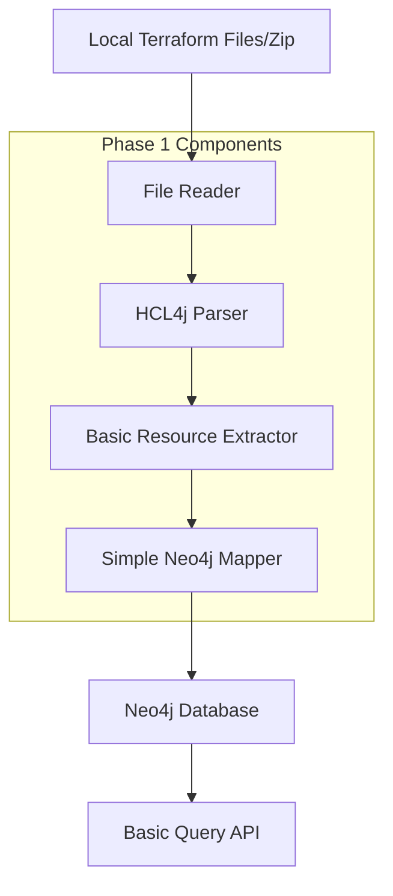
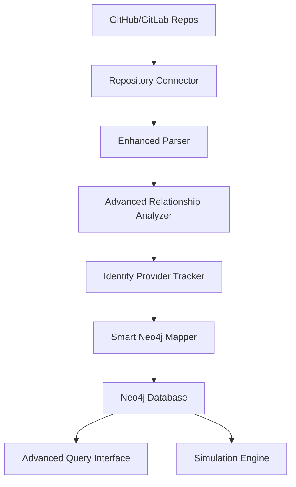

# Design Document

## Overview

The Terraform-to-Neo4j Parser is a focused component that transforms Terraform configurations into a graph database representation. Starting with a simple approach, this system will parse Terraform files from local directories or zip files using HCL4j, extract infrastructure components and their basic relationships, and create a Neo4j graph. The design emphasizes simplicity and extensibility, with a phased approach: Phase 1 focuses on local file parsing and basic graph creation, while Phase 2 will add repository integration and advanced features.

## Architecture

### Phase 1: Simple File Parser (MVP)



### Phase 2: Repository Integration (Future)



### Component Interaction Flow (Phase 1)

1. **File Input** → Read .tf files from local directory or extract from zip
2. **HCL Parsing** → Parse Terraform syntax into structured data
3. **Resource Extraction** → Extract basic resource information and properties
4. **Graph Creation** → Create simple Neo4j nodes with basic relationships
5. **Query Interface** → Provide basic querying capabilities

## Components and Interfaces (Phase 1 - MVP)

### 1. FileInputHandler Service

```java
@Service
public class FileInputHandler {
    
    public List<TerraformFile> readTerraformFiles(String inputPath) {
        if (inputPath.endsWith(".zip")) {
            return readFromZipFile(inputPath);
        } else {
            return readFromDirectory(inputPath);
        }
    }
    
    private List<TerraformFile> readFromDirectory(String directoryPath) {
        // Recursively find all .tf files
        return Files.walk(Paths.get(directoryPath))
            .filter(path -> path.toString().endsWith(".tf"))
            .map(this::readTerraformFile)
            .collect(Collectors.toList());
    }
    
    private List<TerraformFile> readFromZipFile(String zipPath) {
        // Extract and read .tf files from zip
    }
}
```

### 2. TerraformParser Service (Simplified)

```java
@Service
public class TerraformParser {
    
    public ParsedTerraform parse(List<TerraformFile> files) {
        List<TerraformResource> allResources = new ArrayList<>();
        
        for (TerraformFile file : files) {
            Map<String, Object> hclAst = hclParser.parse(file.getContent());
            allResources.addAll(extractResources(hclAst));
        }
        
        return ParsedTerraform.builder()
            .resources(allResources)
            .build();
    }
    
    private List<TerraformResource> extractResources(Map<String, Object> ast) {
        // Simple resource extraction - just get type, name, and properties
    }
}
```

### 3. BasicResourceExtractor Component

```java
@Component
public class BasicResourceExtractor {
    
    public List<InfrastructureComponent> extractComponents(ParsedTerraform parsed) {
        return parsed.getResources().stream()
            .map(this::createComponent)
            .collect(Collectors.toList());
    }
    
    private InfrastructureComponent createComponent(TerraformResource resource) {
        return InfrastructureComponent.builder()
            .id(generateId(resource))
            .type(resource.getType())
            .name(resource.getName())
            .provider(detectProvider(resource.getType()))
            .properties(resource.getArguments())
            .identityType(detectIdentityType(resource)) // Generic identity detection
            .build();
    }
    
    private IdentityType detectIdentityType(TerraformResource resource) {
        // Detect identity resources across providers:
        // GCP: google_service_account
        // AWS: aws_iam_role, aws_iam_user
        // Azure: azurerm_user_assigned_identity, azurerm_service_principal
        if (resource.getType().contains("service_account") ||
            resource.getType().contains("iam_role") ||
            resource.getType().contains("iam_user") ||
            resource.getType().contains("user_assigned_identity") ||
            resource.getType().contains("service_principal")) {
            return IdentityType.IDENTITY_RESOURCE;
        }
        return IdentityType.REGULAR_RESOURCE;
    }
}
```

### 4. SimpleNeo4jMapper Service

```java
@Service
public class SimpleNeo4jMapper {
    
    private final Neo4jTemplate neo4jTemplate;
    
    public void mapToGraph(List<InfrastructureComponent> components) {
        // Clear existing data
        clearGraph();
        
        // Create nodes
        createNodes(components);
        
        // Create basic relationships based on resource references
        createBasicRelationships(components);
        
        // Create basic indexes
        createIndexes();
    }
    
    private void createNodes(List<InfrastructureComponent> components) {
        for (InfrastructureComponent component : components) {
            String cypher = """
                CREATE (n:Resource {
                    id: $id,
                    name: $name,
                    type: $type,
                    provider: $provider,
                    identityType: $identityType,
                    properties: $properties
                })
                """;
            
            neo4jTemplate.query(cypher)
                .bind(component.getId()).to("id")
                .bind(component.getName()).to("name")
                .bind(component.getType()).to("type")
                .bind(component.getProvider()).to("provider")
                .bind(component.getIdentityType().toString()).to("identityType")
                .bind(component.getProperties()).to("properties")
                .run();
        }
    }
}
```

### 5. BasicQueryService (Phase 1)

```java
@Service
public class BasicQueryService {
    
    private final Neo4jTemplate neo4jTemplate;
    
    public List<ResourceNode> getAllResources() {
        String cypher = "MATCH (n:Resource) RETURN n";
        return neo4jTemplate.query(cypher)
            .fetchAs(ResourceNode.class)
            .all();
    }
    
    public List<ResourceNode> getIdentityResources() {
        String cypher = "MATCH (n:Resource) WHERE n.identityType = 'IDENTITY_RESOURCE' RETURN n";
        return neo4jTemplate.query(cypher)
            .fetchAs(ResourceNode.class)
            .all();
    }
    
    public List<ResourceNode> getResourcesByProvider(String provider) {
        String cypher = "MATCH (n:Resource) WHERE n.provider = $provider RETURN n";
        return neo4jTemplate.query(cypher)
            .bind(provider).to("provider")
            .fetchAs(ResourceNode.class)
            .all();
    }
}

## Data Models (Phase 1 - Simplified)

### Core Data Models

```java
@Data
@Builder
public class TerraformFile {
    private String fileName;
    private String filePath;
    private String content;
}

@Data
@Builder
public class TerraformResource {
    private String type;        // e.g., "google_compute_instance"
    private String name;        // e.g., "web_server"
    private Map<String, Object> arguments; // All resource configuration
}

@Data
@Builder
public class ParsedTerraform {
    private List<TerraformResource> resources;
}

@Data
@Builder
public class InfrastructureComponent {
    private String id;          // Generated unique ID
    private String name;        // Resource name
    private String type;        // Resource type
    private String provider;    // GCP, AWS, Azure (detected from type)
    private IdentityType identityType; // IDENTITY_RESOURCE or REGULAR_RESOURCE
    private Map<String, Object> properties; // All configuration properties
}

public enum IdentityType {
    IDENTITY_RESOURCE,  // Service accounts, IAM roles, etc.
    REGULAR_RESOURCE    // Compute, storage, network resources
}

@Data
@Builder
public class ResourceNode {
    private String id;
    private String name;
    private String type;
    private String provider;
    private String identityType;
    private Map<String, Object> properties;
}
```

### Neo4j Schema Design (Phase 1 - Simple)

```cypher
// Simple Node Structure
(:Resource {
    id: String,           // Unique identifier
    name: String,         // Resource name from Terraform
    type: String,         // Resource type (e.g., google_compute_instance)
    provider: String,     // Cloud provider (GCP, AWS, Azure)
    identityType: String, // IDENTITY_RESOURCE or REGULAR_RESOURCE
    properties: Map       // All Terraform configuration as JSON
})

// Basic Indexes for Performance
CREATE INDEX resource_id FOR (r:Resource) ON (r.id);
CREATE INDEX resource_type FOR (r:Resource) ON (r.type);
CREATE INDEX resource_provider FOR (r:Resource) ON (r.provider);
CREATE INDEX resource_identity_type FOR (r:Resource) ON (r.identityType);
```

## Error Handling

### Parsing Error Handling

```java
@Component
public class TerraformParsingErrorHandler {
    
    public ParseResult handleParsingErrors(String terraformContent) {
        try {
            ParsedTerraform result = terraformParser.parse(terraformContent);
            return ParseResult.success(result);
        } catch (HCLSyntaxException e) {
            return ParseResult.failure(
                ErrorType.SYNTAX_ERROR,
                "Invalid HCL syntax at line " + e.getLine(),
                e.getDetails()
            );
        } catch (UnsupportedResourceException e) {
            return ParseResult.partialSuccess(
                e.getParsedResources(),
                "Unsupported resource types: " + e.getUnsupportedTypes()
            );
        }
    }
}
```

### Neo4j Connection Error Handling

```java
@Component
public class Neo4jErrorHandler {
    
    @Retryable(value = {Neo4jException.class}, maxAttempts = 3)
    public void executeWithRetry(Runnable operation) {
        try {
            operation.run();
        } catch (Neo4jException e) {
            logger.warn("Neo4j operation failed, retrying: {}", e.getMessage());
            throw e;
        }
    }
    
    @Recover
    public void recover(Neo4jException e) {
        logger.error("Neo4j operation failed after retries: {}", e.getMessage());
        // Fallback to in-memory storage or queue for later processing
    }
}
```

## Testing Strategy

### Unit Testing

```java
@ExtendWith(MockitoExtension.class)
class TerraformParserTest {
    
    @Mock
    private HCLParser hclParser;
    
    @InjectMocks
    private TerraformParser terraformParser;
    
    @Test
    void shouldParseBasicTerraformResource() {
        // Given
        String terraform = """
            resource "google_compute_instance" "vm" {
              name = "test-vm"
              machine_type = "e2-medium"
              service_account {
                email = "test@project.iam.gserviceaccount.com"
                scopes = ["cloud-platform"]
              }
            }
            """;
        
        // When
        ParsedTerraform result = terraformParser.parse(terraform);
        
        // Then
        assertThat(result.getResources()).hasSize(1);
        assertThat(result.getResources().get(0).getType())
            .isEqualTo("google_compute_instance");
    }
}
```

### Integration Testing

```java
@SpringBootTest
@Testcontainers
class Neo4jIntegrationTest {
    
    @Container
    static Neo4jContainer<?> neo4jContainer = new Neo4jContainer<>("neo4j:5.0")
            .withAdminPassword("password");
    
    @Autowired
    private Neo4jGraphMapper graphMapper;
    
    @Test
    void shouldCreateNodesAndRelationships() {
        // Given
        List<InfrastructureComponent> components = createTestComponents();
        List<ComponentRelationship> relationships = createTestRelationships();
        
        // When
        graphMapper.mapToGraph(components, relationships, new ServiceAccountMapping());
        
        // Then
        // Verify nodes and relationships exist in Neo4j
        String cypher = "MATCH (n:Resource) RETURN count(n) as nodeCount";
        Long nodeCount = neo4jTemplate.queryForObject(cypher, Long.class);
        assertThat(nodeCount).isEqualTo(components.size());
    }
}
```

### End-to-End Testing

```java
@SpringBootTest(webEnvironment = SpringBootTest.WebEnvironment.RANDOM_PORT)
class TerraformToNeo4jE2ETest {
    
    @Test
    void shouldParseComplexTerraformAndCreateGraph() {
        // Given - Complex Terraform with GCP resources and service accounts
        String complexTerraform = loadTestFile("complex-gcp-infrastructure.tf");
        
        // When - Parse and map to Neo4j
        RestTemplate restTemplate = new RestTemplate();
        ResponseEntity<ParseResult> response = restTemplate.postForEntity(
            "/api/terraform/parse",
            new ParseRequest(complexTerraform),
            ParseResult.class
        );
        
        // Then - Verify graph structure
        assertThat(response.getStatusCode()).isEqualTo(HttpStatus.OK);
        
        // Verify service account relationships
        String saQuery = """
            MATCH (sa:ServiceAccount)-[:USES_SERVICE_ACCOUNT]-(r:Resource)
            RETURN sa.email, collect(r.name) as resources
            """;
        
        List<ServiceAccountUsage> usage = queryNeo4j(saQuery);
        assertThat(usage).isNotEmpty();
    }
}
```

### Performance Testing

```java
@Test
void shouldHandleLargeTerraformFiles() {
    // Test with 1000+ resources
    String largeTerraform = generateLargeTerraformFile(1000);
    
    StopWatch stopWatch = new StopWatch();
    stopWatch.start();
    
    ParsedTerraform result = terraformParser.parse(largeTerraform);
    
    stopWatch.stop();
    
    assertThat(stopWatch.getTotalTimeMillis()).isLessThan(5000); // 5 seconds max
    assertThat(result.getResources()).hasSize(1000);
}
```